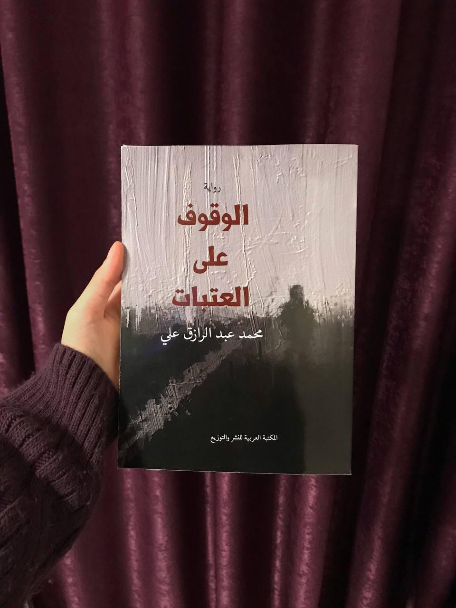

+++
title = "الوقوف على العتبات"
description = "تتفلتُ لتدرك أن خطاكَ لم تُجدي نفعًا، وأن لا أثرًا لك على طريقكَ الوحيد، وواقفٌ أنت على أعتاب ذاتك وحياتك، عابرًا كنت."
date = 2022-03-26
+++

حينما يسيرُ المرء كيفما رسمت له الحياة خُطاها، هل يُلام يومًا على رضوخه لإرادة الخُطى؟ تسيرُ لأن الحياة لا تعرف سوى السير ولا نملك سوى أن نجاريها، ماذا وإن تفلتت عن مسارك فيها رغمًا عنك؟ باغتتك أهم أركانها بإقصائك منها، أنّىٰ لك أن تُدرك مسارًا جديدًا أو تركض وراء سرابٍ القديم؟
ومنهكٌ يأكلك السؤال، يراودك حضورٌ جارف آلَ إلى غيابٍ سحيق، الغيابُ الذي يطعنك بمفاجئته وغموضه، يتركك مُتخبطًا دون وجهةٍ أو سبيل. 

تتفلتُ لتدرك أن خطاكَ لم تُجدي نفعًا، وأن لا أثرًا لك على طريقكَ الوحيد؛ ليس الأثر الحالم الواهب للخلودِ وإنما الأثر العاديّ، بصمة الخطى ودلالة المسير. وواقفٌ أنت على أعتاب ذاتك وحياتك، عابرٌ كنت، لا تجيد إقبالًا أو إدبار.

هل نحب لأجل الحب؟ أم أن سببًا ما أوقعنا في الحب؟
قلوبنا لا تشبه بعضها؛ حينما تغدو نورًا في عين إحداهنَّ فتقع في حبك، وتغدو في عين الأخرى قبوًا تودُّ لو تخرج منه. 
كيف يستمدُ المرء إيمانه من عينٍ كافرةٍ بسجيته؟ تلك العينُ الذي ودَّ أن ينظر فيها ليجد ذاته فإذا بها لا تراه..

حينما تأتينا ثورة، عندما نقومُ بثورة، فإننا نثورُ على ذواتنا أولاً، نسيرُ في مظاهرةٍ ندرك بها ركود خطانا الحائرة، زيفُ الطريق الذي بدا آمنًا. تنشبُ اشتباكاتٍ ذاتيةٍ عناصرها ماضٍ لم نحبه، واقعًا لم نختره، ومستقبلًا لا نودُّ أن نكونه، نصوبُّ سهم الحقيقةِ الجارح الذي يعرفُ كيف يصيب فريسته، يترك جرحًا لا يندمل، عندما يصيبُ الجرحُ جرحًا آخر، تختلطُ الدماء رغمًا عنّا ويدفع الجميعُ الثمن. 
كي تؤتي الثورة ثمارها لابد أن نلمس التغيير، تلك الذات الثائرة على نفسها هل تصير أخرى نرتضيها؟ ربما.
 —

الوقوفُ على العتبات،
روايةٌ اجتماعية، تدور أحداثها أيام الثورة، بسردٍ يتميزُ بعاديِّةٍ فريدة، وقعها خفيفٌ آسِر، بمسحةٍ أدبيةٍ رقيقة، وجمالياتٍ تفرض صدقها، ولغةٍ جيدة تتخللها عاميةٌ مناسبة تخففُ من كثافة السرد.
 بجوٍ مناسبٍ تمامًا للأحداث، للثورة، لحداثة اكتشاف وسائل التواصل الاجتماعي آن ذاك، للمشاعر الإلكترونية التي تفرضها الوحدة أحيانًا، والتي تؤول إلى حقيقةٍ تلبي نداء الرغبة.
تدور الأحداث عن ثلاثةٍ أشخاصٍ رئيسية، إلى أين ستودي بهم الحكاية؟ تعلمون، أحيانًا لا تودي الحكاية إلى نهايةٍ بعينها، لتدرك أنك حقًا مازلت لا تُحسِن سوى الوقوفُ على العتبات..
٢٦ مارس ٢٠٢٢م

