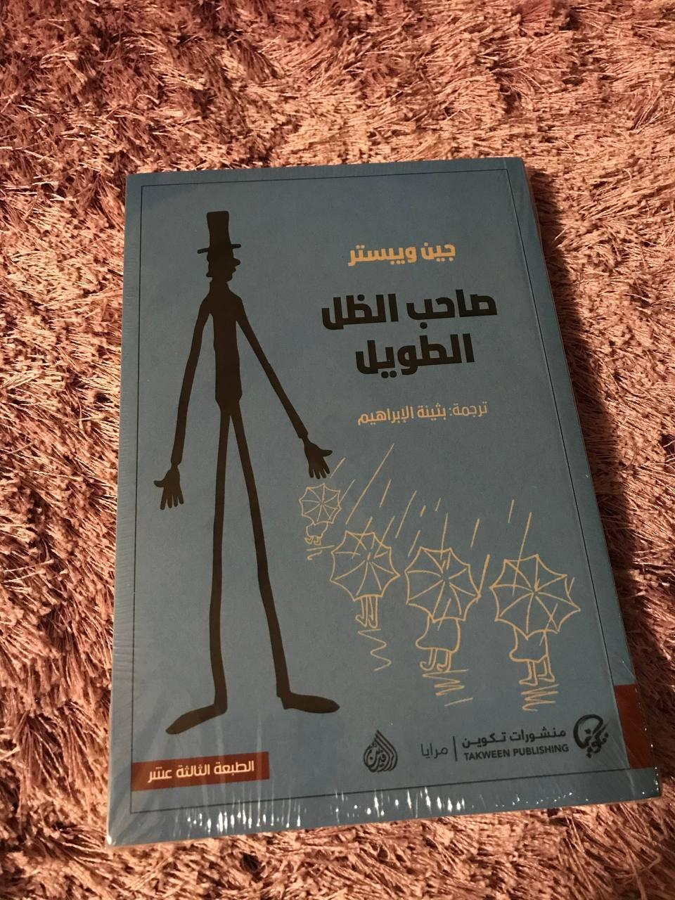

+++
title = "صاحب الظل الطويل"
description = "تعلمين؟ ربما لن يتسع الوقتُ دائمًا، من المؤكدِ أن تغيب شمس وجودنا، لكنني أشعرُ بأن داخل روحي قلمًا ينثرُ كل ما لم يسعه الوجود. يكفي أننا نسيرُ وداخل قلبينا شمسًا."
date = 2022-03-16
+++

عزيزتي الرقيقة جودي،
كم أنّكِ عذبة، عيناكِ واسعتان لتضمّا العالم، وقلبكِ رحبٌ ليتسع جماله وحزنكِ آمنًا. بسيطةٌ ببداهةٍ وعميقةٌ بذكاءٍ يُسعد الوجود.
عزيزتي،
لو أننا نجدُ مَن ننتمي إليه، مَن يقرأ كلماتنا بقلبه وينتبه لترهاتنا وكأنها حدث جلل. مَن نفقدُ راحتنا لأجله راضيين، ونفتقده فقدًا سعيدًا حتى نلتقي مجددًا.

أيتها الفيلسوفة الصغيرة، الكاتبة الناشئة، التي تودُّ أن يتسع الوقت والعالم فتفيض عليهما من فكرها كيفما تشاء، أحببتكِ كثيرًا.
تعلمين؟ ربما لن يتسع الوقتُ دائمًا، ولن يؤذن لكل أفكارنا بالخلود، من المؤكدِ أن تغيب شمس وجودنا ونغرُبَ عن وجه العالم، لكنني أشعرُ بأن داخل روحي قلمًا ينثرُ كل ما لم يسعه الوجود. يكفي أننا نسيرُ وداخل قلبينا شمسًا.
وأننا نكتبُ؛.. 
لأن حياتنا تستحقُ الكتابة عنها، وأن حبيبًا -وإن لم نعرفه بعد- نخبيء له الحكايا، فلا يفوتنا شيء.

خالص مودّتي،
ملاحظة: أسرتني مواضع "المودة" في رسائلكِ، لم تكن كلمةً مُنتقاه وإنما فرضها ودٌّ صادق.
التي أحبتكِ،
مودّة
١٦ مارس ٢٠٢٢م
——
 
روايةٌ آسرة، وأكتفي بحديثي إلى جودي لا عنها، وأتساءلُ ماذا لو أن أصدقاء بالكتب صاروا حقيقة؟.
ألهمني ذلك الكتاب في بدء نوعٍ جديدٍ من الرسائل وددت البدء فيها لكن حال التردد، بمثابة سيرة ذاتية أدبية، إلى أحدهم، الذي أجلس معه وكأنني أجلس إلى نفسي.

