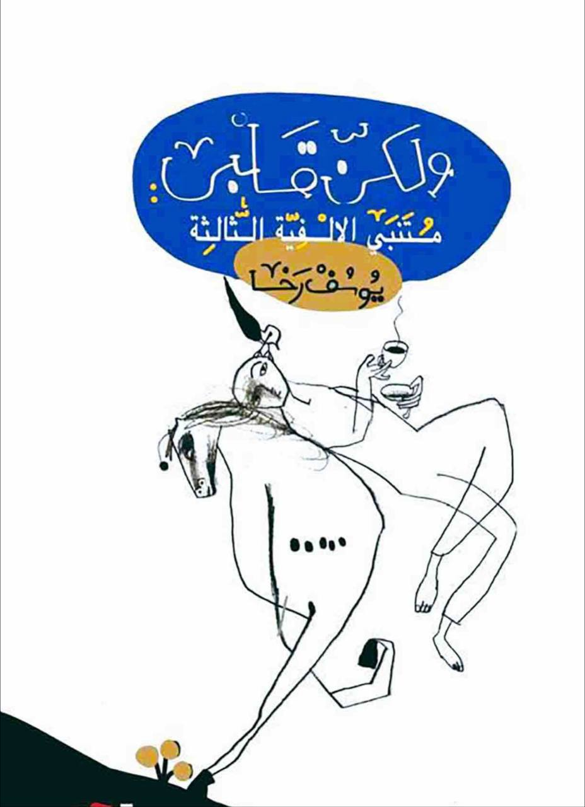

+++
title = "ولكنَّ قلبي: رحلةٌ بين شطي القراءة والكتابة"
description = "لا أذكر تحديدًا متى عرفت الكتابة، حدث ذلك في سنٍ صغيرة، ربما منذ أدركتُ أن لي قلبًا. طالبني الصغير الافصاحَ عن ذاته، ربما منذ أصاب قلبي ثقبًا، فصار ألمًا يطالب الصراخ عن وجعه. تلك الرغبة المغوية، تفاحة الخلد التي تغوينا فنكتب آملين في استشفاءٍ وخلدٍ لحزننا الجميل."
date = 2022-11-02
+++

<h4 style="text-align: center;">ولكنّ قلبي</h4>
في مساء كل يوم وبأكتوبر تحديدًا أتذكر أني لا أكتب. أشعر بالحزن أحيانا وبالخيبة أحيانا، خيبة أن يهجرك ما تحبه ويؤنسك، فكرة السأم التي تطاردني كشبحٍ فيُحال بيني وبين ما أحب. رغم اتساع اللغة إلا أنها تضيق بأصحابها كثيرًا، واللغة واسعة كبحر. يصاب البحّارة أحيانًا بدوار البحر، الأمر أشبه بدائرةٍ مغلقةٍ -وأحيانًا مفرغة- من الأفكار والكلمات تنتهي لتبدأ من جديدٍ حتى يصيبها عطب. أُسلّم جسدي للماء، أقرأ حتي أصلح سفينتي المعطوبة وأعود من جديد. هكذا أخذت هدنةً من الكتابة إلى القراءة، وبصدفةٍ ما تتماسُ حالتي مع الكتاب الذي اختارني لا أنا. الكاتب يوسف رخا الذى أتجه بالكتابة إلى القراءة قائلاً: "أفكر أن الإيمان بالشعر ممكن ممارسته في القراءة وهذا الأوقع. هناك شعرعظيم مكتوب بلغةٍ أفهمها ولا علاقة له بي، لا علاقة له بما يحصل في العالم. لأول مرة أحس بأني ناضجٌ ورائقٌ بما يكفي لأُبدي القراءة على الكتابة فعلاً ليختار ديوان المتنبي صاحبًا ولا يعرف أنه يستعد لمشروع كتابةٍ ليس فقط صعبًا ولكن شخصي قائلًا: "ثلاثة أشهر أو أقل منذ بدأت أقرأ وها أنا أكتب ولا أدرى" أعتقد هذه هي الكتابة عندما تجود. 

 

<h5>هل كان الوجع فكانت الكتابة أم عرفنا الكتابة فأتقنّا الوجع؟</h5>
لا أذكر تحديدًا متى عرفت الكتابة، حدث ذلك في سنٍ صغيرة، ربما منذ أدركتُ أن لي قلبًا. طالبني الصغير الافصاحَ عن ذاته، ربما منذ أصاب قلبي ثقبًا، فصار ألمًا يطالب الصراخ عن وجعه. تلك الرغبة المغوية، تفاحة الخلد التي تغوينا فنكتب آملين في استشفاءٍ وخلدٍ لحزننا الجميل فيصير ملكًا لا يبلى. تقول آني إرنو: "ليست وظيفة الكتابة أو نتاجها طمس جرحٍ أو علاجه، وإنما اعطاؤه معنىً وقيمة، وجعله في النهاية لا يُنسى." هكذا تحدث يوسف عن الخرم الذي في صدره، عن حقيقة الوجع الذي يؤول بالنهاية إلى شعور. الوجع الذي يسوقه للكتابة عنه ليس بدافع الاستشفاء ذاته وإنما ليصير شئً جميلًا يدعو الآخرين إليه، وحينما يبصر الآخرين هذا الخرم يصير نافذته الجديدة إلى العالم. "كلانا مخذول بما يكفي ليعتكف أو ينتحر فلماذا يظل القلب ينتج شعرًا مثل ماكينة تُنتج عصافير؟" كعصفورٍ يغرد وتلك وسيلته الوحيدة للبكاء، يغرد منشدًا لا تحسبن رقصي بينكم طربًا فالطير يرقص مذبوحًا من الألم.  

 

<h5>الشعر يغير العالم.</h5>
دائما كنت أسألني مالشعر؟ مالذي يفرقه عن غيره من الكلام؟ وحينما كنت صغيرةً كانت تفتنني القوافي بآخر الأبيات فأقول الشعر هو الكلام المُقفى، الأحرف التي تتراقص بغنج بآخر كل بيت فتطربني. هو إيجاد التفعيلة ومعرفة البحر. هو كل القواعد التي لا تقل أهمية عن المعنى بل تسبقه أحيانًا. أعلم هذا غير راضية تمام الرضا. كان تعطشي للمعني يدفعني دائمًا للبحث عن بئر واسعٍ لكلام غير الكلام، لمعانيٍ لا أعرفها وكلماتٍ تلبس حلةً لم أراها من قبل. الشعر هو الكلام الذي لم يُقال. الكلام الذي لا يمكن أن يقال. هو الصمت أمام المعنى والتفكّر.. كيف علّم الله الإنسان الكلام، كيف علّم آدم الأسماء كلها؟ الكلام أوجد العالم، والشعر يغيّره دائما.  
يقول يوسف رخا بعدما تساءل عن كينونة الشعر:"الشعر عكس هذه الاشياء لأنه يجعل للكلام سلطة على الواقع، نعم. لكنه عكسها أيضًا لأنه يفتح زاوية نظر إلى العالم خارج الإطارات. يتيح رؤية شيء غير المقرر رؤيته. وبهذه الطريقة يجعلك حيًا" 

 

<h5>آفة زمننا الشعريّ والهروب من الشعر إليه.</h5>
يفتح يوسف رخا عيني على رؤية جديدةٍ لتذوق الشعر، للنعيم بأصالته بأي زمانٍ ومكان، لتعريفه بقدرته على أن يقول شئً دائمًا، حتى في عز ما يكون تعبيرًا عن الحرب والأبوية والعنصرية، أن يقول شئً آخر حاضرًا فيه جمال أدبي وخبرة إنسانية. شيء يتجاوز لحظته ويرتفع فوق معناه ليسافر عبر الزمن. هكذا سافر بيه ديوان المتنبي ليعود إلينا بحلةٍ جديدة مُعلنا رغبة الهروب من الزمن الشعري وشروطه المضحكة. الهرب حتى من الطموح والبحث عن كتابةٍ تستحق الاهتمام. الشعر الذي يصنعنا فنصنعه، يجدد كلانا الآخر فى ثوبٍ يتحدث عن صحابه كما تحدث عن ذاته، نسج الحديث مع القديم حتى يكونا واحدًا كما الشعر وصاحبه. 

 

<h5>الشعر ماء القلب يُزهره ويرويه</h5>
"سمّي القلب قلبًا لتقلبه" هكذا يقول لسان العرب. وعبر القلب تنعقد الصلة بين الشعر والتحوّل. الثورة أيضًا بهذا المعنى مرادفةً للشعر. وَجَل القلب وامتعاضه من الركود هو الذي يدفع للاحتجاج. القلب يعني القلق. الجمرة التي لا تهدأ وتبحث عن معنى دائمًا. الصلة التي تنعقد بين القلب والشعر ليست سوى لحظة تلاقٍ. إنها طرب التعرف على المحبوب وبتوجيه الكلام إليه هناك تسليمًا بضرورة الغرام. يتأكد هذا لي مع قول الكاتب أنه يقرأ بحثًا عن أبياتٍ توقف قلبه. "لكن البيت الذي يضربنى في قبي يكون عني أنا" تلك اللحظة التي لأجلها نقرأ. 

 

<h5>أنزف كزجاجةٍ تنام على موجٍ</h5>
أرى علامات الاستفهام دائمًا بأفواهٍ مفتوحة، وبدلأ من أن توجه أفواهها تجاه أسألتي وتأكلها كانت تأكلني أنا. وتحب أن تترك أثرها فلا تبتلعني كافة فأستريح. لم يدميني شيء كأسئلتي التي لم تجد إجابةً تداويها. حينما كانت تقرضني مساء كل ليلة أذهب فأختبئ في حضن النوم لكن الأخير حياةٌ موازية، عالمٌ آخر ذا سلطانٍ محكم. تحدث يوسف عن الخزي، عن نزفه الدائم "كيف لم أنتبه أن الأسئلة والذكريات تدميني؟ في هذه الدنيا فقدٌ لا يحتمل. أحيانًا يكون الموت أرحم." جاء ذكره للخزي والنوم متعاقبين مناسبًا تمامًا ربما لأنهما لي متلاصقين. بالنوم "الموت الصغير" الذي يمكن أن يصبح زيارةً للجنة أو جريمة أراني نارًا تأكل أسئلتي، أجعل منها حطبًا أشعله. بالنوم أيضًا يأتيني اعتذار صديقتي التي طالما انتظرته، كان قصيدة مكتوبة بماء الدمع وانسابت بخفةٍ حانيةٍ حتى اطمئن قلبي. يراودني النوم عن نفسي ورغم ذلك الحياة مجهدة لدرجة أننا نحتاج أن نموت قليلًا كل يوم. هذا القلب.. يشرب ماء الشعر ويستلقي على شجونه الخضراء، يحمل الحب والقصيدة والرغبة في خلق جديد. 

 

ولكنّ قلبي سمكةٌ والحب كالتاريخ" 
"أعدُكِ. في انتفاضات قلبي كل أسرار المحيط 

