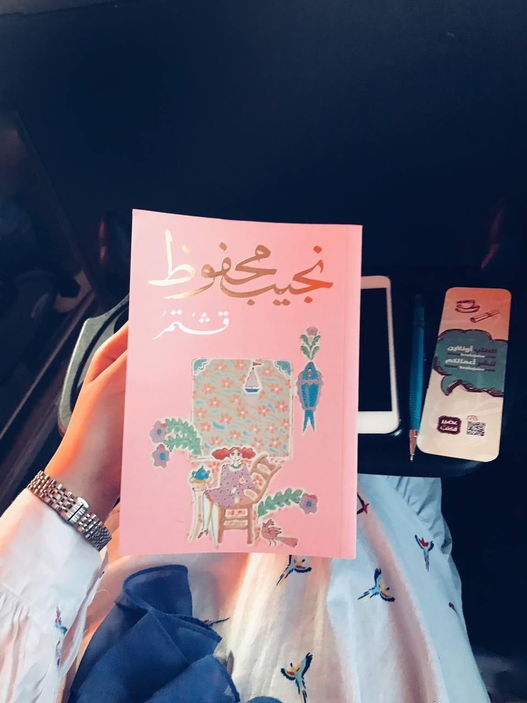

+++
title = "قشْتمر"
description = "التحموا بتجانس روحي صمد للأحداث والزمن، الصداقةُ في كمالها وأبديتها، منذُ الطفولة الخضراء وحتى الشيخوخة المتهاوية، حتى الموت."
date = 2021-08-15
+++

هذه أولُ قراءاتي لنجيب محفوظ، أقبلتُ عليها وأتمنى الشعور بأن شيئًا قد فاتني لتأخري في القراءة له.
هذه الرواية الجميلة، الجديرةُ أن ترافقك في طريق، لأنها رِفقةٌ معجونةٌ بالرِّقةِ العتيقةُ والأصيلة، رقةٌ لا يجرحُ بها أحدهم الآخر، وأصيلةٌ فلا تفسد مودتهم أو تذوبُ حبالها العذبةُ والكثيفة.
(التحموا بتجانس روحي صمد للأحداث والزمن، حتى التفاوت الطبقي لم ينل منه، الصداقةُ في كمالها وأبديتها، منذُ الطفولة الخضراء وحتى الشيخوخة المتهاوية، حتى الموت.)
تدورُ أحداثها بالعباسية حيُّهم، وفي قشتمر مقهاهم، في أركانه تسجلت أصواتهم مخلدة البسمات والدموع وخفقاتٍ لا حصر لها من قلب مصر.

هي الأحلام، الاستقلالُ التامُّ أو الموتُ الزؤام، الطفولةُ البريئةُ، الصِبا الشقيُّ، الشبابُ الحالمُ والمتهوِّر، البحثُ عن الطريق، التعثرُ والتلاقي، هي مغزلٌ من الفلسفةِ والثقافةِ والعلم. 

الفنِّ والوفاء والحب والموت؛ الفنُّ الذي يضفي على أهله هالة متفردة، والوفاء الجميل كالحبّ، والحب هو الحب الذي في حضوره تتلاشى القوى المضادة جميعًا في غمضةِ عين. والموتُ الذي يبدأ بالذاكرة، وموتُ الذاكرة أقسى أنواع الموت، ففي قبضته تعيش موتك وأنت حيّ، وتُرَدُ وأنت لا تدري إلى الأمِّيّة.

مجمعُ السمر، والليالي الحبلى بالعجائب، وسلاسلُ الهزائم التي لا نهاية لها. 
فيها المتصوِّفُ، رأى فيه صاحبه سحرًا جديدًا، حام حوله وثمل به، واتجه نحو قبلته من عوالج قلبه. فيها المهمومُ بالوطن والسياسة، والحيُّ الذي لا يجدُ من الأملِ مفر. فيها الشاعرُ الذي طفح قلبه بالأسى، ولكنهُ كان أكبر من أن يفرِّط في روحه.

(سيلٌ ينهمرُ من الحواديت، وفيضانٌ من النكت، وضطرب بلا حدود لعواطف متناقضة، من أقصى الحزن إلى أقصى الفرح، ولكن جرثومة الكآبة استقرت في أعماق كل نفس.)

الكثيرُ من الأحاديث الكثيرةُ والعميقة، والتي تزامن فيها أيضًا حقبًا سياسيًا بدأت من عهد الملك فاروق إلى السادات. هي ركن الوفاء والمودة الصادقة.

الكثير من الحديث، لكن أختتمه بما أختتمه الأصدقاء الأربعة، في مقهى قشتمر احتفالاً بمرور سبيعن عامًا على صداقتهم؛
فيقولُ صادق صفوان: "أقول وأنا أستعيذ بالله من الحسد والحاسدين أن سبعين عامًا مرَّت فلم تند عن أحدنا هفوة تسيء إلى الوفاء من قريب أو بعيد، ألا فليدم هذا الصفاء وليكن مثلاً للعالمين.."
وقال حمادة الحلواني: "لو جمعنا الضحكات التي روينا بها قلوبنا المنهكة بكئوس الأحداث لملأت بحيرة من المياه العذبة الصافية..
وقال طاهر عبيد: "أحقًا نحن نحتفل بمرور سبعين عامًا على صداقتنا؟ لقد مرت على بلادنا سبعون عامًا، أما صداقتنا فلم يمر عليها سوى دقيقة واحدة..
وقال إسماعيل قدري: "ينطوي التاريخ بما يحمل، ويبقى الحب جديدًا إلى الأبد.."

هذه الرواية نكأت حلمي الذي لم يكتمل كما أريد، لا أعلم هل سأجد الرفيق حين البحث عن حلمٍ جديد؟ ربما، الحياة تستحق، ونحن أكثر.

