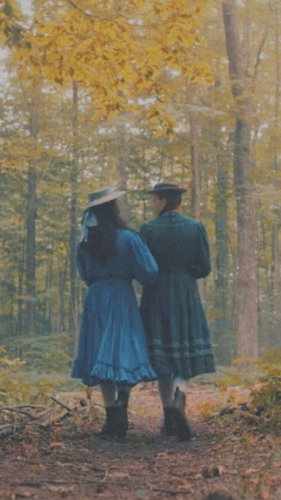

+++
title = "أثر الفراشة"
description = "بيدٍ صغيرة وحبٍ كبير، بخطىً رقيقةٍ وأملٍ جميل، منّة وأنا نسيرُ معًا، اثنتان اثنتان."
date = 2022-04-16
+++

<head>
    <meta property="og:image" content="/public/mawadda-menna.jpg" />
</head>

(١)  
اثنتان اثنتان، تقفان بجوار بعضهما مؤتنستين، حينما لا تحتاج النظر إلى الوراء لتتيقن أن ظلك يتبعك؛ وهبتني الحياة روحًا تسير جواري. بيدٍ صغيرة وحبٍ كبير، بخطىً رقيقةٍ وأملٍ جميل، منّة وأنا نسيرُ معًا، اثنتان اثنتان.

(٢)  
 كعصفورةٍ تحلق في سماء الكون، لا تكترثُ للأرض وما فيها، تحملُ الأماكن والذكريات والأحباب في قلبها، بقلوبٍ كأفئدكة الطير، تطيرُ وتعلم أن الله يرزقها، تخرجُ خماصًا بيقينٍ أنها ستعود بِطانًا. وبدون اليقين، مَن سيحيا في العالمين؟

(٣)  
أحب السير إلا أنني لا أسيرُ كثيرًا خشية قدمي التي تؤلمني سريعًا، الآن أسيرُ طويلاً وأعرف كيف أتحملُ الألم راضية.

(٤)  
حينما نكبر قليلًا نكف عن اللعب، وأنا كففتُ اللعب مع الحياة، لعبتها المنع والعطاء، ولأنها ليست عادلة؛ لم تلعب بشرفٍ وخسرت.  
آلامتني يدي ثلاث مراتٍ قبل؛  
مرةً حينما شددتُ بكل قوتي على ما أملك،  
ومرةً حينما انتزعته الحياة مني عنوةً،  
ومرةً حينما مددت يدي لعطاياها ولم تعطني.  
الآن أرخيها تمامًا،   
وأستسلمُ لأقدار الإلٰه العادلة.  

(٥)  
قال فؤاد حداد: "طيب كإنه لو كدب هيموت"، حينما فكرتُ في وصف نفسي بجملةٍ أحببتُ أن تكون:  
"خفيفة كريشة لو اتسابت هتطير."  
أحبُّ الخفة نهجًا للعيش، حينما نحمل دنيانا على يدنا، بينما خفة أقدامنا تحملنا وتحملها. وأذكر قول محمود درويش دائمًا:  
"أثر الفراشة لا يُرى،  
أثر الفراشة لا يزول  
هو جاذبيّةُ غامضٍ  
يستدرجُ المعني، ويرحلُ  
حين يتضح السبيل."  
أشعر أحيانًا أني فراشة، بكل هذه الخفة، برقة جناحيها وتداخل الألوانِ عليهما.

(٦)  
ألوِّحُ للطفلةِ داخلي وأبتسم، لا أقول وداعًا لأني لا أحب الوداع، وأقول إلى اللقاء لأنني أحب اللقاء. أسأل نفسي؛ من أين جاءت كل هذة الوداعة التي تحفني الآن؟

أنا وديعة، مستسلمة تمامًا، ويفيض على عيني امتنانُ إلى الأيام التي كانت، كيفما كانت.  
أستقبلُ عامًا جديدًا، وأحمل القديم داخلي وأسير..  
أحب الرحلة.

١٥ رمضان ١٤٤٣هـ  
١٦ إبريل ٢٠٢٢م

