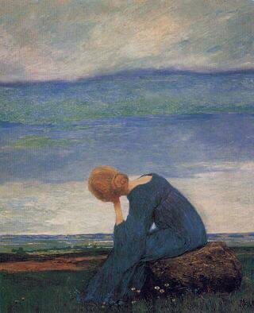

+++
title = "نتحملُ ونحاول"
description = "أحاول العودة مجددًا كمن يتمرّس المشي بعد ركودٍ طويل، أشعر بخدرٍ في ذاكرتي وأرى في قلبي سؤال: كيف ستجمع كل تلك الكلمات العالقة على جدراني؟"
date = 2024-09-01
+++

إنها ليلة الأول من سبتمبر، أحاول العودة إلى حياتي الأدبية التي وضعتها على الرفّ منذ وقتٍ طويل.  

أصبحت تخنقني تلك الكلمات التي تقف داخلي ولا تخرج، خفت أن أنسى قدرتي على الكتابة والبوح، وأن يصير عاديًا تكدس الأشياء والمشاعر داخلي، حين أبتعد عن الكتابة أفقد جزءًا من شجاعتي، من أن لي صوتًا يمكن أن يسمعه الجميع، والحقيقة أن سعادتي وسكينتي في أنه خرج من داخلي حتى وإن لم يسمعه أحد. 

أحيانًا أفقد رؤيتي للحياة، أعيش فيها دون أن أراها، وأنا التي اعتدتُ تأملها طيلة الوقت، أكبُر قليلاً لأدرك أن عيناي وقلبي ليسا رهن إشارتي دائمًا؛ وتمر الأيام والشهور والحياة ثقيلةٌ عليّ،  تصيبني حساسيةٌ جامحة تجاه كل الأشياء والمشاعر، فلا أقوى على الغوص داخل بحرٍ هائج بلا مجداف. 
أتكوّر بركنٍ في محيط نفسي المُوحِش وقلبي على راحتيّ. 

لا أترك نفسي للموجة لأنني أخاف, أقف على الشاطيء وأعلم أن هناك ما يفوتني ولا حيلة لي حتى ألحق به،  علمني خوفي كيف أقف وأراقب الحياة من بعيد، لا أقف وحيدةً لأنه يقف جواري -ابتسامة حمقاء- 

وأحاول مرات ومرات، وتأتيني الأفكار فجأةً وتخنقني حمولة قلبي ، وحينما أحاول نقلها من نفسي إلى الورق أدرك أنها أثقلُ مني ومازلتُ هشّة على نقلها وحدي. 

قلت قبل ذلك أننا نكتب "لأن الليل طويلٌ يحن إلى حكاية وحتي لا يخوننا اليقين ولأننا يراودنا الحنين" 
صار ليلي طويلٌ بلا حكايا، حتى أنني لم أعد أهرب كما السابق من حكاياتي إلى حكايا الآخرين، فقط يراودني في ليلي سؤال: تلك الحكاية التي لم يكتبها صاحبها، من يقصها عليه حينما يخونه اليقين ويراوده الحنين؟ 

أحاول العودة مجددًا كمن يتمرّس المشي بعد ركودٍ طويل، أشعر بخدرٍ في ذاكرتي وأرى في عينيْ قلبي سؤال: كيف ستجمع كل تلك الكلمات العالقة على جدراني؟ 

ربما لا أملك الجواب بعد، وأخاف أن تتداخل كل الأشياء إن جمعتها جملةً واحدة، أتذكر صبر الكتابة التي كنت أعرفه وأحاول إخراجه من غيابات نفسي القلقلة العجولة، ربما حينها سأجمعها جملة جملة 

وغدًا تزهر الجملة جوار الجملة 

وتؤنسها قافية واحدة، 

وربما تغدو قصيدة أستلقي في بيتها على شجوني الخضراء. 

