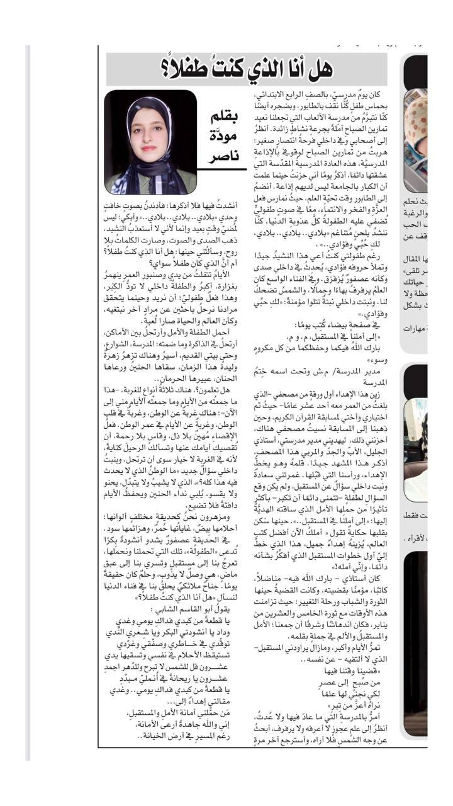

+++
title = "هل أنا الذي كنتُ طفلاً؟"
description = "الأيامُ تتفلتُ من يدي وصنبور العمرِ ينهمرُ بغزارة، أكبرُ والطفلةُ داخلي لا تودُّ الكِبَر، وهذا فعلٌ طفوليّ."
date = 2021-09-28
+++

إهداءٌ إلى،..  
مَن حمَّلني أمانة الأملِ والمستقبلِ،  
إني والله جاهدةً أرعى الأمانة،  
رغم المسيرِ في أرض الخيانة..  

—  
هل أنا الذي كنتُ طفلاً؟

كان يومٌ مدرسيّ، بالصفِ الرابع الإبتدائي، بحماسِ طفلٍ كُنَّا نقف بالطابور، وبضجره أيضًا كنّا نتبرّمُ من مدرِسة الألعاب التي تجعلنا نعيد تمارين الصباحِ آملةً بجرعةِ نشاطٍ زائدة. أنظرُ إلى أصحابي وفي داخلي فرحةُ انتصارٍ صغير؛ هربتُ من تمارين الصباح لوقوفي بالإذاعةِ المدرسيَّة، هذه العادة المدرسيةُ المقدّسة التي عشقتها دائمًا، أذكرُ يومًا أني حزنتُ حينما علمت أن الكبار بالجامعة ليس لديهم إذاعة. أنضمُ إلى الطابور وقت تحيّةِ العلم، حيثُ نمارس فعل العزَّةِ والفخر والإنتماء، معًا في صوتٍ طفوليٍّ تُضفي عليه الطفولةُ كلَّ عذوبةِ الدنيا، كنَّا ننشدُ بلحنٍ مُتناغم "بلادي.. بلادي.. بلادي،
لكِ حُبِّي وفؤادي.." ،  
رغم طفولتي كنتُ أعي هذا النشيدُ جيدًا وتملأ حروفه فؤادي، يُحدِثُ في داخلي صدى وكأنه عصفورٌ يُزقزق. وفي الفناء الواسع كان العلَمُ يرفرفُ بهاءًا وجمالًا، والشمسُ تضحكُ لنا، ونبتت داخلي نبتةٌ تتلوا مؤمنةً: "لكِ حبِّي وفؤادي."

في صفحةٍ بيضاء كُتِب يومًا:  
"إلى أملنا في المستقبل، م. وم.  
بارك اللهُ فيكما وحفظكما من كل مكروهٍ وسوء"  
مدير المدرسة/ م.ش وتحت اسمه خِتمُ المدرسة  

زين هذا الإهداء أول ورقةٍ من مصحفي -الذي بلغتُ من العمر معه أحد عشر عامًا- حيثُ تم اختياري وأختي لمسابقة القرآن الكريم، وحين ذهبنا إلى المسابقة نسيتُ مصحفي هناك، أحزنني ذلك،  ليهديني مدير مدرستي، أستاذي الجليل، الأبّ والجدّ والمربي هذا المصحف، أذكر هذا المشهد جيدًا، قلمهُ وهو يخطُّ الإهداء، ورأسنا التي قبّلها. غمرتني سعادةٌ ونبت داخلي سؤالٌ عن المستقبل، ولم يكن وقع السؤالِ لطفلةٍ -تتمنى دائمًا أن تكبر- بأكثر تأثيرًا من حملِها الأمل الذي ساقته الهديَّةُ إليها؛ "إلى أملنا في المستقبل..". حينها سَكن بقلبها حكايةٌ تقول " أملكُ الآن أفضل كتب العالم، يُزينهُ إهداءٌ جميل، هذ الذي خطَّ إليّ أول خطوات المستقبل الذي أفكِّرُ بشأنه دائمًا، وإنّي أمله!"
كان أستاذي -بارك الله فيه- مناضلاً، كاتبًا، مؤمنًا بقضيته، وكانت القضيةُ حينها الثورة والشباب ورحلة التغيير؛ حيث تزامنت هذه الأوقات مع ثورة الخامس والعشرين من يناير، فكان اندهاشًا وشرفًا أن جمعنا؛ الأمل والمستقبلُ وأنا في جملةٍ بقلمه.
تمرُّ الأيام وأكبر، ومازال يراودني المستقبل-الذي لا ألتقيه- عن نفسه..

"قضينا وقتنا فيها  
من صُبحٍ  إلى عصرِ  
لكي نجني لها علمًا  
نراهُ أعزَّ من تِبرِ"  
أمرُّ بالمدرسةِ التي ما عادَ فيها ولا عُدتُ، أنظرُ إلى علمٍ عجوزٍ لا أعرفه ولا يرفرف، أبحثُ عن وجه الشمسِ فلا أراه، وأسترجع آخر مرةٍ أنشدتُ فيها فلا أذكرها؛ فأدندنُ بصوتٍ خافتٍ وحدي "بلادي.. بلادي.. بلادي.." وأبكي؛ ليس لمُضيّ وقتٍ بعيد وإنما لأني لا أستعذبُ النشيد، ذهب الصدى والصوت، وصارت الكلماتُ بلا روح، وسألتُني حينها: هل أنا الذي كنتُ طفلاً؟ أم أنَّ الذي كان طفلاً سواي؟

الأيامُ تتفلتُ من يدي وصنبور العمرِ ينهمرُ بغزارة، أكبرُ والطفلةُ داخلي لا تودُّ الكِبَر، وهذا فعلٌ طفوليّ؛ أن نريد وحينما يتحقق مرادنا نرحلُ باحثين عن مرادٍ آخر نبتغيه، وكأن العالم والحياة صارا لُعبة.
أحمل الطفلة والأمل وأرتحلُ بين الأماكن، أرتحلُ في الذاكرة وما ضمته؛ المدرسة، الشوارع، وحتى بيتي القديم، أسيرُ وهناك تزهرُ زهرةٌ وليدةُ هذا الزمان، سقاها الحنينُ ورعاها الحنان، عبيرها الحرمان..

هل تعلمون؟، هناك ثلاثةُ أنواعٍ للغربة، -هذا ما جمعتُه من الأيام وما جمعتْه الأيام مني إلى الآن-؛ هناك غربةٌ عن الوطن، وغربةٌ في قلب الوطن، وغربةٌ عن الأيام في عمر الوطن. فعلُ الإقصاءِ مُهينٌ بلا ذل، وقاسٍ بلا رحمة، أن تُقصيك أيامك عنها وتسألك الرحيلَ كنايةً، لأنه في الغربة لا خيار سوى أن ترتحل. وينبتُ داخلي سؤالٌ جديد "ما الوطنُ الذي لا يحدث فيه هذا كله؟"، الذي لا يشيبُ ولا يتبدّل، يحنو ولا يقسو، يُلبي نداء الحنين ويحفظُ الأيام دافئةً فلا تضيع.
ومزهرون نحنُ كحديقةٍ مختلفٍ ألوانها؛ أحلامها بِيضٌ، غاياتُها حُمرٌ، وهزائمها سود.
في الحديقةٍ عصفورٌ يشدو أنشودةً بِكرًا تُدعى "الطفولة"، تلك التي تحملنا ونحملها، تعرجُ بنا إلى مستقبلٍ وتسري بنا إلى عبق ماضٍ. هي وصلٌ لا يذوب، وحلمٌ كان حقيقةً يومًا. جناحٌ ملائكيٌ يحلقُ بنا في فناء الدنيا لنسأل "هل أنا الذي كنتُ طفلاً؟"

يقولُ أبو القاسم الشابي:  
يا قطعةً من كبدي فداكِ يومي وغدي  
وداد يا أنشودتي البكر ويا شِــعري النّدي  
توقّدي في خــــاطري وصفّقي وغرّدي  
تستيقظ الأحلام في نفسي وتسقيها يدي  
عشـــــرون قل للشمس لا تبرح وللدّهر اجمدِ  
شـــرون يا ريحانةً في أُنـمليْ مــبدّدِ  
يا قطعةً من كبدي فداكِ يومي.. وغدي  

