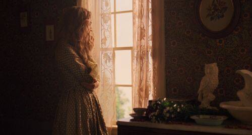

+++
title = "الأيام كنهرٍ لا يُرى وأثرٍ يزول"
description = "تراودني فكرة اليقين والشهود على مرور الزمن، الوعي الحاضر بأن الأيام تمضي والوقت ينساب حتى وإن لم أجد علامةً أذكره بها. أحبُّ العلامات لأني أُتقن التيه، وأحب الذكريات كي لا أجيد النسيان."
date = 2022-11-24
+++

أتساءل عن موقع الأيام العادية من العمر، تلك التي تنساب بخفةٍ دون أن أشعر، لا تعلق بالذاكرة ولا تحتل ركنًا بزاوية القلب، لا تُحدِث صدىً في نفسي، ورغم أن الأصداء تؤرقني إلا أنني أحب امتلائي بها أو ربما امتلائها بي. لها جمالٌ لا يترك أثرًا وهذا مُربك، كقرص الشمس الملتهب جمالاً واكتمالاً وقت الغروب، حينما أراه وأذهب لدعوة أحدٍ يراه معي أعود فلا أجده.  

 
تراودني فكرة اليقين والشهود على مرور الزمن، الوعي الحاضر بأن الأيام تمضي والوقت ينساب حتى وإن لم أجد علامةً أذكره بها. أحبُّ العلامات لأني أُتقن التيه، وأحب الذكريات كي لا أجيد النسيان. أُنقِّب عن موقفٍ أو حدثٍ أحفظُ به أيامي؛ لتبقى حاضرةً في خريطة العمر التي أخلقها في ذهني، أحبُّ الحضور وأحاول صنعه لأني تذوقت كثيرًا مرارة الغياب.  

 
تمرُّ الأيام عاديةً، لا يسعني سوى الانتباه إلى أنها تمرّ، أحيانًا لا أقدر على صنع حدثٍ استثنائي لأقطع رتابتها. أذكر قول أمي المأثور عن جدتي -رحمها الله- أن العادية نعمةٌ تستجلب الحمد، وأن اليوم العادي الخالي من الحزن هو يومٌ سعيد. وأرى أنه منطقيٌّ وكافٍ أحيانًا غياب أحد المعاني فيحضر الآخر ضمنيًا ونستشعره راضيين.  

 
وأتساءل هل ستروي العاديةُ عطش أرواحنا الدائم؟ هل ستجلب لنا الرضا عن ذواتنا كما تستجلب الحمد؟ هل ستكون كفايةً بحضورها الباهت فنعتاده ونألفه مطمئنين؟  
أتمنى أن تكون ذاكرتي حاضرة دائمًا، ألا يخوننا العمر فنسأل يومًا كيف مضى وتفلت منَّا.. في يومٍ ما -إن اتسع العمر- سأروي حكاية تقول:  
كانت تعيش أيامًا عاديةً بسيطة، تُتقن تفاصيلها كما تتقن كيف تعيش، كان العمر ينساب أمامها كنهرٍ تلمس ماءه بين يديها، كانت واعية وراضية. حتى أن تلك حكايةٌ مُكتملةٌ كافية. 

