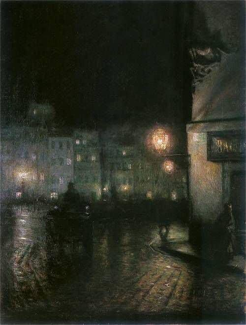

+++
title = "عربة الحلم"
description = "في الطريقِ كنتُ وحيدًا يعلمُ أنه لن يجد رفيقه، وكنتُ  أتمرسُ اعتياد الوحدة، فالعابرون أشدُ لطفًا على قلوبنا المرهقة، لأن الأخيرة مازالت تُعاني خذلان الهَجر الصامت."
date = 2020-12-07
+++

في الليلِ وبعد أن ركد ضجيجُ المدينة، ساقتني عربةُ الحلم إلى وسط الطريق؛ فقد أُرهقت ساقي من السيرِ الطويل، وآلامني ظهري مِن كثرةِ الأحمال؛ فالأحلامُ في مدينتنا لا تبدو خفيفةً كما يراها النائمُ، والأمنياتُ ليست كما النجوم صغيرة مُضيئة. ولأنَ الليلَ قاتمٌ يظهرُ كل شيء على أرضه، هو بقعةٌ مناسبة يمكن أن نرى فيها حقيقة أنفسنا وأحمالنا. 
وددتُ أن أحمل في عربتي كل شيءٍ، أن أبتاع الحبَّ والأمل، وأشتري سُترةً من الذكرى علّها تُدفئني، وتسترُ الشوق. وكان داخلى الفقيرُ -رغم أن بضاعتهِ مزجاه- لا يمانع التصدُّق بما يَملكُ، حين يطلب عونَهُ فقيرٌ آخر.

في الطريقِ كنتُ وحيدًا يعلمُ أنه لن يجد رفيقه، وكنتُ  أتمرسُ اعتياد الوحدة، فالعابرون أشدُ لطفًا على قلوبنا المرهقة، لأن الأخيرة مازالت تُعاني خذلان الهَجر الصامت.
كان الطريقُ خاليًا إلا من شاعرٍ، يبتاع الحزن ويُنشدُ القصائد بصوتٍ عذب. نظر في عيني فشعرتُ بالضيق، ولا أحبُ أن ينظر إلى عيني أحد، يُربكني ذلك الأمر. 

وكنتُ أبحثُ أي شيءٍ أقتنيه، لأن السفر طويلٌ، والأيام حبلى بتوأمي الفجعةِ والمفاجآت. يبدو أن البائعين استنفذوا بضاعتهم فرحلوا، وكعادتي جئتُ في الوقتِ الذي لا يثمنُ ولا يغني من جوع.
كانت حوائط الجدرانِ فارغة فكتبتُ عليها حكايتي وقصصتُ أسراري؛ ليحتضنُها عابرٌ وتُرمى في غياباتِ الغربة. ولم أكن أحبُّ الإفصاح عني قديمًا، ولكن كان البوحُ  لزامًا فلا أُصاب بداء الصمت. سردتُ بعضه وختمتُ الحديث بتلك العبارة "لو وجدنا من يسمعنا لتركنا صحيفة الجدرانِ فارغة."

توقفت عربتي التي تحملني فجأةً، وتمنيتُ من قلبي أن توصلني إلى غربتي قبل أن تنجلي سُترة الليلِ، ويراني أهل المدينة، وأخذتُ أتلو القصيدة وأنشدُ الحزن إلى أن تسير بي مجددًا.

