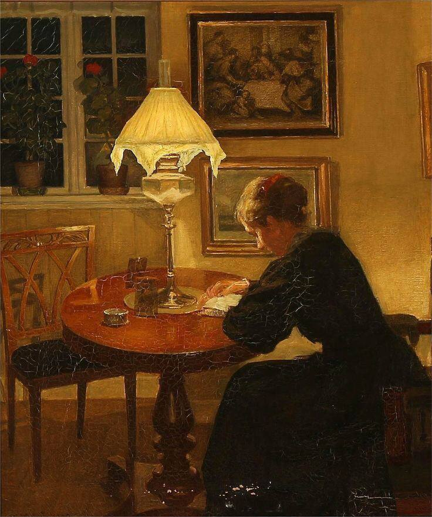

+++
title = "في معنى أن نموت"
description = "
يُحكى أنَّ:\n
قلمٌ في الفرح لصاحبه أعذبُ رنّة\n
ورقةٌ في الدنيا لساكنها أجملُ جنّة
"
date = 2023-12-13
+++

ما جدوى الصدى إذا ما تنفّس صوتنا؟ 
وما الصوتُ إذا ما أسمعَني صراخي؟ 
حينما تجفُّ الصحف؛ بماذا أنادي قلمي المعطوب؟ 
ألغتي هشةٌ فلا تحملني، أم أنني متعبةٌ فلا أقوى على حملها؟ 
كان كلانا مجدافًا يبحرُ بقارب النجاة إلى الحياة،  
الحياة بعيدةٌ عنّا؛ الحلم مرسانا والرحلة غايتنا، 
الوصول غوايتنا،.. فتنتنا التي نحبها وتراوغنا. 
على سطح الموج كنا نرسم العالم؛ 
اللغة ريشتي، وقلبي ألوانها. 
ما فائدة الكتابة إذا لم يسعنا براح الكلام من ضيق الدنيا؟ 
إذا لم يبرئنا حنان المجاز من قسوة الألم. 
وإذا لم يُحينا أملٌ بالحياة بعد كدر اليأس وموتٍ كبير، 
الموت يفتح لي فمه، 
ولا أخافه، 
أخاف أن يبتلع صوتي قبل أن يبتلعني.. 
ما معني الحياة إذا عجزت أن تصرخ: "أنا حيّ" 
وهل يموت المرء منا حينما يصاحب الموت؟ 
حينما يغزل من الموت حكاية تُروى من بعده، 
يكتب بريشته، ويلوّن بآخر رمقٍ من قلبه حكايته، 
رحلته -التي كانت غايته-، 
يُحكى أنَّ: 
قلمٌ في الفرح لصاحبه أعذبُ رنّة 
ورقةٌ في الدنيا لساكنها أجملُ جنّة 
يُحكي أنَّ: 
كان العالم لي كلمة، 
فكانت دنيا. 
إن خَرِب القلم وجفّت صحفي، 
كان الموت، 
وكانت دنيا. 

