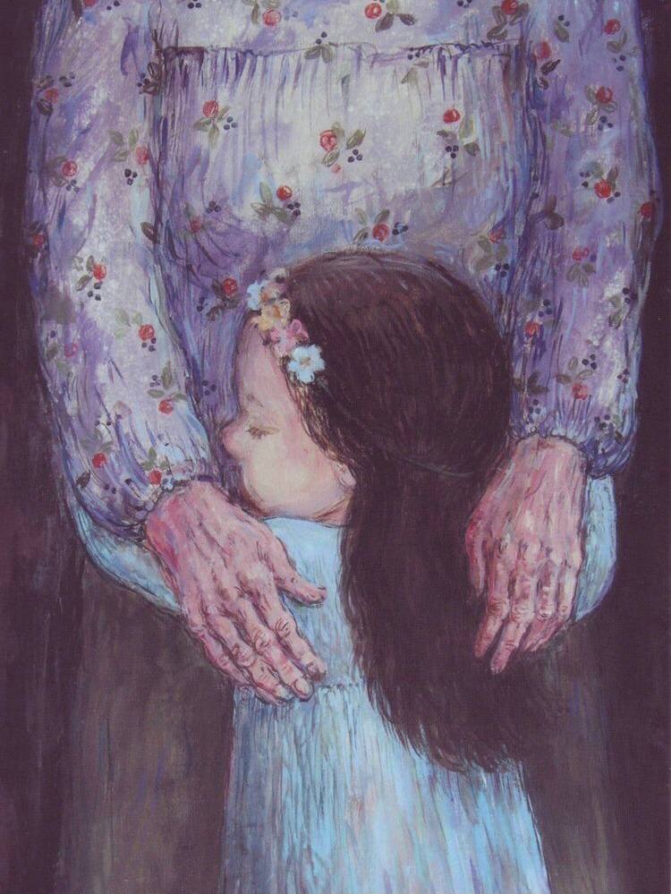

+++
title = "الوداع في خمسة مشاهد (الجزء الثاني)"
description = "أقفُ بعيدًا جدًا، أنا داخل المشهد وقلبي خارجه، لا أقوى على الإقدام فخطوتي مجروحة، فقط أراقب كل الأشياء حولي، يتعثّر قلبي ولا ينطلق لساني، ومحاربٌ مجرّدٌ من أسلحته لماذا يدخل أرض المعركة؟"
date = 2023-05-30
+++

<b>المشهد الثالث:</b> 
بِتُّ أعي هذا الألم جيدًا، لا أعلم هل كبرتُ فاتسع قلبي ليحمل الآلام، أم حملتها عنوة فكبرت؟ أحمله ولا أطيقه، صار جزءًا مني، أذكره تارةً، وعمدًا أتناساه تارةً أخرى. يدقّ الوداع بابي مجددًا، أو هكذا أحب أن يُخيّل لي، وأنا منهكةٌ من معركتي السابقة، وآمل أنها أشباح خوفٍ تراودني. كنّا بمنزله، هذه المرة أهدتني البيوت الأمل؛ فهي لا تُسلِّم أصحابها بسهولة، لا تفرّط فيهم أبدًا ولا ترحل، نحن نرحل ربما لكنها تبقى، هكذا حدّثت نفسي.  
يزاولنا المرض من جديد، دخولٌ عصيٌ مفاجيء، هذه المرة تتفننُ العقاقير في إحكام قبضتها على الذاكرة، تمسك ما تريد، وبين الثانية والأخرى يدخلُ عالمنا ويذهب في عالمٍ آخر.. أعلم هذه الحرب جيدًا، قلبي يسألني ماذا أفعل؟ أغامر برصيد المحبة الزائدة التي طالما رَوت شغاف قلبي، بنظرةٍ قاسية أرى الغربة ترمقني من بعيد، وأنا عنيدةٌ حيال معاركي، عِندٌ واهنٌ هذه المرة، يرجو النجاة فقط لإنه لن يتحمل الغرق. صوتي مرتعشٌ يحاول الخروج مجددًا، أنا فلانة هل تعرفني؟ مراتٍ ومراتٍ أسأل ويقين المحبة يدفعني، عرفني أخيرًا! لا أصدق، محبتي لا تخونني، بجملٍ حانيةٍ يردُّ على، أُقبّل يده، أبكي وأبتسم. الآن اطمأن قلبي وغلبني الأمل؛ البيت، الحب، نحن، الطعام الذي اعتدنا، والجمع، كل الأشياء تقول أنه سيكون على مايرام، شيء واحد لم يقل، كانت لإنارة البيت نظرة أخرى، ضوء الصالون البرتقالي الدافيء خافتٌ قليلاً هذه المرة، أول مرةً لا يملأ الضوء الأركان، وكأن الضوء يصدر همهمة حزينة، وكأن عيناه متعبتان. البيوت تحزن على أصحابها، هكذا تقول أمي. قلبي يسألني من جديد؛ هل هو عطبٌ مؤقت؟ أم أنها شارة نجمٍ بالأفول؟ لا أعلم يا قلبي، يراودني اليقين يا حبيبي بأننا جميعًا سنكون على ما يرام. 
أنا والوداع هذه المرة صديقان، على الأقل تعادلنا منذ آخر لقاء، صارت بيننا أُلفةً لم أفهم سببها، هل اعتدنا أم أنه القلب يروّض نفسه على الأوجاع؟ بدا لي أننا رفيقان مُنهكان، مُتعبان من السفر، مجبوران على المُضيّ سيرًا في طريق القدر، يتعكز كلانا على الآخر حتى يصل لآخر الطريق.. حينما نادانا القدر وغاب قمري الجميل، رأيتني أضم الوداع ويضمني؛ بكينا بكاءً طويلًا، بكينا سويًا هذه المرة.. 

<b>المشهد الرابع: </b> 
هل أخافني الوجع أم أوجعتني الهزائم؟  
أقفُ بعيدًا جدًا، أنا داخل المشهد وقلبي خارجه، لا أقوى على الإقدام فخطوتي مجروحة، فقط أراقب كل الأشياء حولي، يتعثّر قلبي ولا ينطلق لساني، ومحاربٌ مجرّدٌ من أسلحته لماذا يدخل أرض المعركة؟ قلبٌ معطوبٌ وعينٌ تحجرت دمعتها، جبناءٌ أنا والوداع هذه المرة، وكأننا نقف على أعتاب طريقٍ وفجأةً انقسم إلى شقين، الماء يجري بيننا، بكاؤنا الذي لم نبكيه هذه المرة، ينظر كلانا إلى الآخر والصمت لغتنا التي فاضت علينا. 

<b>المشهد الخامس: </b> 
بالليل يهدهد شجني صوت عبدالوهاب قائلاً "لما انت ناوي تغيب على طول مش كنت آخر مرة تقول، لما انت ناوي.." تلامس نبرته المُعاتبة الشجينة فؤادي، هل كان ينقصنا الوداع يا عبدالوهاب؟ هل سيخفف حدّة الفراق أم سيزيد وطأته؟ بالغياب كنت أتخيل أحبتي يبتسمون قائلين "ودعني من غير ما تسلّم وكفايا قلبي أنا مسلِّم" ربما هذا يكفي. 
أشاهد مسلسلاً ما، بالمشهد يجلس صديقٌ مع صديقه يتسامران وقد زيّن الشيب رأسهما، يخبر أحدهم الآخر أنه ذاهبٌ للقاء حبيبته، فيضحك فرحًا لصاحبه الذي وجد الحب مجددًا بعد سنين، ينصحه أن يستمتع بالحب لآخر قطرةٍ فيه. كلاهما كان على ما يرام، يُسلم على صديقه العاشق، ورغم أنني رأيتهم أكثر من مرةٍ يسلم كلاهما على الآخر، إلا أنني شعرت أن هذه المرة مختلفة. للحظاتٍ قلت ربما هذا الوداع وطرت الفكرة عن رأسي، راهنت عليها في خفاء، تمرُّ المشاهد ويعود العاشق ليحكي لصاحبه فلا يجده، مات صاحبه. أبتَسم، أبتسم مجددًا؛ لأنني بِتُّ خبيرة بأمور الوداع، بتفاصيله الرقيقة الذائبة، بمقدماته الواهنة الحانية، أفهمُ نظرة العين المودِّعة، وطبطبة اليد على الجسد بعد الحضن الأخير. أشمُّ رائحة الوداع من بعيد، ويلحظ قلبي نوبات الوجع قبل أن تصل. الوداع جزء مني الآن، أفهمه جيدًا قبل أن يفصح عن ذاته، آهٍ كم كبرت. 

