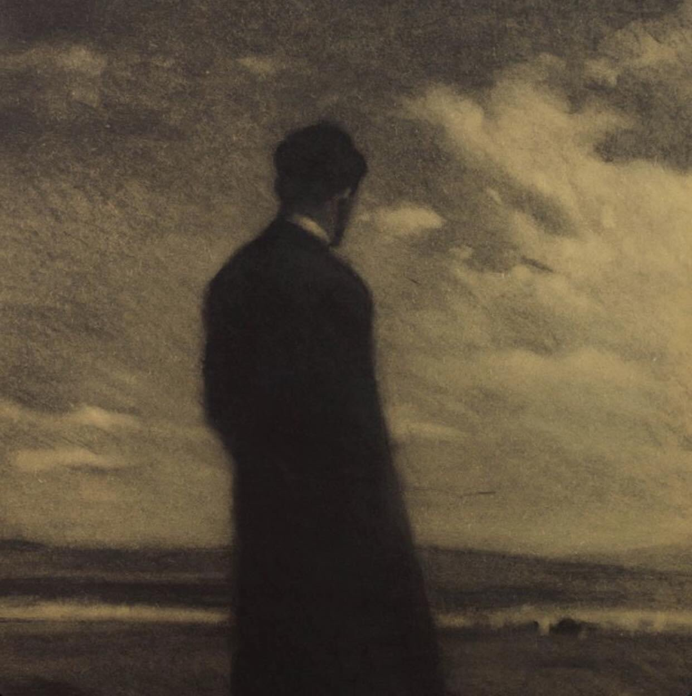

+++
title = "لم أعد أخاف"
description = "ولم يحُل الخوف بين وبين خسارةِ ما خفتُ عليه، كنتُ أخافُ لآمن، وأسألُ الله ألا يُذهِب خوفي سُدى"
date = 2021-10-27
+++

أتعلمين؟، لم أعد أخاف، ولا أعلم متى غادرني الخوف، لا يعني هذا أن لي قلبًا صلبًا أو أني شجاع، لا، فلي قلبٌ لا أعرفه، كلُّ ما في الأمرِ أنِّي خِفتُ كثيرًا قبل، ولم يحُل الخوف بين وبين خسارةِ ما خفتُ عليه، كنتُ أخافُ لآمن، وأسألُ الله ألا يُذهِب خوفي سُدى، والآن نفد رصيدي من الأمنِ والقلق، ولا أعلمُ أي شعورٍ أعيش؟
بسذاجةِ الأطفال كانت تُحدثني نفسي؛ إن الله لن يساوي بين الذين ينامون آمنين في حجورهم وآخرين يلدعهم الخوفُ فلا يهنأون بنوم، بين صديقٍ كان يدعو برجاءٍ خائفٍ ألا يبتليه الله في صحبته، وبآخرٍ كان لا يذكرُ تلك المسألة في دعائه، وبين عنايتي الشديدة بكتبي، ملابسي، هداياي ولعبتي خوفًا من التلف، وآخرين لا يكترثون لشيء. 
كنتُ أعيش الخوف كلَّ يومٍ في خيالي حيال كلِّ الأشياء التي أحبها، أمي وأبي وأخوتي، رفاقي وأحلامي وعالمي، وأذهب إلى ما وراء الخوفِ لألتقيه، أخبِرهُ أني أعرفه جيدًا، ولا داعٍ لأن يزورني، سأذكره دائمًا وآتي إليه وفق رغبتي..
وكان الأخيرُ ذا سُلطانٍ كبير، يتجبَّرُ على من يهابه -كعادةُ السلاطين في أوطاننا-، طعنني الخوفُ في ظهري، علم بشأن مخاوفي وسلبَنيها كلها، انتزعها منّي واحدة تِلو الأخرى، وخدعني بالوقت، لم تنفعني زياراتي إليه، وكانت الفجعة كلَّ مرةٍ كأنها الأولى، وللخوفِ سطوةٌ، ومع كل فقدٍ ومع كل خيانةٍ كان ينقصُ من نصيبه في قلبي شيء، تسربَّ مني دون أن أشعر، ولا شيء أبكي عليه. وحينما لا يجدُ المرء سببًا يبكي عليه، تنتابهُ رغبةٌ شديدة بالبكاء، هل هذا سببٌ كافٍ؟ ربما.
الآنَ أنا غريبٌ يا عزيزتي، غريبٌ لا يملك شيء، لا يخاف شيء، ولا يبكي على شيء..
أتساءلُ فقط عن قلبي الذي بتُّ لا أعرفه، أتحسسهُ فيتبينُّ لي أنه خالٍ سوى مِن خراب. أعيشُ ولا أحيا، وأحبُّ أحيانًا لكن لا أخاف، هل يُجدي الحبُّ بلا خوف؟
اسنتفذتُ كلَّ أشيائي جملةً واحدة، 
واستنفذتني كلُّ أشيائي واحدةً واحدة.
لو أنَّ لي أمنيةً، سأسألُ الله أن يهبني قلبًا جديدًا، وأن يضع فيه الحكمة والشعور فلا يذهبُ كلَّ شيءٍ سُدى دفعةً واحدة.
ولو أنَّ لي سؤالًا، سأسألُ الله: هذا الخوفُ يا الله لن يضيعُ عندك جملة واحدة؟.

