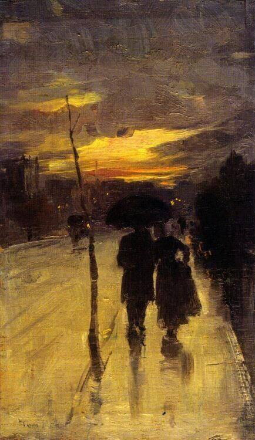

+++

title = " لأن الحب ليس عاديًا"
description = "أن يعتادك مَن يحبك فتتحول من تشبيهٍ جميلٍ بمطلع قصيدةٍ  إلى جملةٍ عاديّة بآخر نصٍ طويل، يعتاد وجودك فتحال من قمرٍ منيرٍ بسط يديه في البعيد إلى جسمٍ مُعتمٍ لا يُرى في القريب. وأتساءل هل تنزل الأقمار إلى الأرض؟ أم أنها حين تغادر السماء لا تعود أقمارًا.."
date = 2023-03-26
+++

كان خوفها الأكبر في الاعتياد، ورغم أن الاعتياد أمرٌ مصيريٌ وربما مرغوب أحيانًا، إلا أنه حين يَمس ذواتنا يصير حفرةً نخاف الوقوع فيها. أن يعتادك من يحبك، يعتاد عينيك التي لم تلمع إلا له؛ فلا يعود يرى فيهما الضوء. يعتاد صوتك الذي طالما حنَّ إلى لحنه وحلم به؛ فلا يكون موسيقاه الحنون يسمعها بشوقٍ نهاية كل يوم، 
يعتاد حبّك الذي كان سؤلَه الوحيد فصار معجزةً كُبرى؛ فلا يصبح سببًا كافيًا للسعادة والهناء أو حتى العيش.  

يعتاد البذل والمحاولة فتصبح كل الجهود المُتعِبة بدافع الحب مجرد فعلٍ عاديٍ باسم الواجب. يعتاد وجودك فتحال من قمرٍ منيرٍ بسط يديه في البعيد إلى جسمٍ مُعتمٍ لا يُرى في القريب. وأتساءل هل تنزل الأقمار إلى الأرض؟ أم أنها حين تغادر السماء لا تعود أقمارًا.. 

أن يعتادك مَن يحبك فتتحول من تشبيهٍ جميلٍ بمطلع قصيدةٍ إلى جملةٍ عاديّة بآخر نصٍ طويل، من حلمٍ بعيدٍ إلى واقعٍ في قبضتيه، وأتساءل مجددًا وأعلمُ أني أتقنُ التساؤل والخوف، لا تنتهى أسئلتي ولا يأكلها الخوف. في عالم كبيرٍ يضجُّ بالغربةِ والقبح والألم، أولا يحقُّ لنا أن نكون تعبيرًا بليغًا أبد الدهر بقصيدة أحدهم؟ مجازًا حلوًا وسط حقائق الوجود المُرَّة، ألا ننطفيء في أعينِ أحبتنا، وألا نندم على قلبٍ كان يسير وحيدًا هادئًا، اعترض الحبُّ طريقه فتعثّر، آمن بالحب وأحب فصار آمنًا، نسي كيف كان وحيدًا والآن يخشى أن يعاود التذكر فلا يطاوعه.. 

تقول رضوى عاشور بروايتها فرج: «غريب أن أبقى محتفظة بنفس النظرة إلى شخص ما طوال ثلاثين عامًا، أن يمضي الزمن وتمر السنوات وتتبدل المشاهد وتبقى صورته كما قرّت في نفسي في لقاءاتنا الأولى». 
لو أن هذا الغريب الذي قالته رضوى صار عاديّا، هل يحدث شيء؟ فقط سننجو من حفر العادية التي نتوقف عن السير مهابة الوقوع فيها. 

تخافُ فيبتسم الخوف ولا يرحل 
تحبُّ فيؤلمها الحبّ ولا تلتئم 
تنتظر المعجزات بعدما ولىّ زمن الأنبياء 
وفي عالمٍ عاديِّ مملؤًا بالبشر، 
كان وطنها رجلاً تحلم أن تكون استثناءه الوحيد 
أبد الدهر،.. أبد الدهر 

