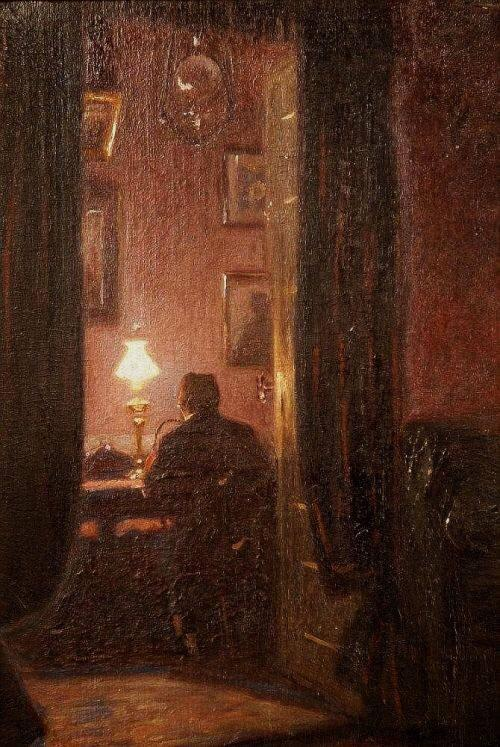

+++
title = "خطاباتٌ تحتضن الليل(الخطاب الأول)"
description = "وددتُ لو أن سمرًا بيننا دائمًا أبدًا. كما تعلم، الليلُ جميلٌ أحيانًا، مُتقلبٌ كما الحياة"
date = 2020-08-22
+++

خطاباتٌ تحتضن الليل  
(الخطاب الأول)  
 
عزيزي أهلاً،  
وددتُ لو يمنحنا العالمُ جلسة سمرٍ نفيض بها عن بعض ما امتلأ به مِداد القلب. وددتُ فقط أن يفهمني أحدٌ على وجه البسيطة، أن يراني بعين الحق ويشعر بي بعينِ قلبه، أن يُحسِن إليّ ويُحبني بصدق، الحبُّ جنّةُ القلبِ وعذابه، فأنا مُعذَّبٌ بفقد ما أُحِب، وحالمٌ بالجنّة الأبدية والملك الذي لا يبلى.  
وددتُ لو أنك جواري وأن سَمرًا بيننا دائمًا أبدًا.  
لا شيء في الحياةِ سهلًا، نحن مُجبرون حتى في أبسطِ خياراتنا، مصابون بالفراقِ وفقد الأحبة. ومُرغمون على التضحيةِ بشيءٍ مقابل شيءٍ آخر. لا تأتي الأشياء دُفعةً واحدة، الحياةُ ليست جنّةً أعلم ولكنها قاسيةٌ عليَّ بعض الشيء، أكذب بل جلَّ الشيء يا صديقي.  
الوحدةُ مُوحِشةٌ، تغزو فراغ قلبِك وتفعلُ به الأفاعيل، تتسلقُ إلى عينيكَ فتُبكيها وتؤرقها، فتعجزُ عن البكاءِ وتودُّ لو تبكي من فرط التعب.  
الحياةُ مُتغيرة، وأنا ثمرتها الناضجةُ، ألا ترى كيف تحول حالي ونضج عقلي؟ ولكن ما فائدةُ النضجِ بعد رحلةٍ مُرهقة؟، النضجُ ليس جميلاً كخيالنا الطفوليّ،  إنه عجوزٌ مُستَتِر، كان ينبغي أن يرشدنا أحدٌ بألا نكبر كثيرًا.  
الونسُ جميلٌ حتى في الوهَن، والرِفقةُ فارقة لذا أختالُ طيفك أمامي، أختلِقُ حديثًا لا تسمعه، وأكتبُ ولا أعلم متى تلتقي الأوجهُ كما الكَلِم.  
وددتُ لو أن سمرًا بيننا دائمًا أبدًا. كما تعلم، الليلُ جميلٌ أحيانًا، مُتقلبٌ كما الحياة، يليقُ بصِدق البوح الخفيف، وبالحزن الثقيل في ذاتِ الآن.  
 
عزيزي، جاهد لتكون بخير، فالخيرُ في دنيانا جِهاد.  
واكتب لي.  
 
٢٢ أغسطس ٢٠٢٠م

