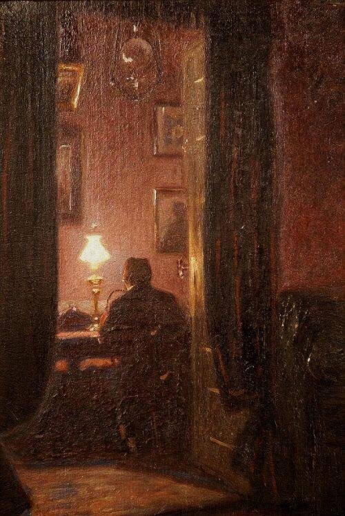

+++
title = "خطاباتٌ تحتضنُ الليل (الخِطابُ الثاني)"
description = "وددتُ لو أن سمرًا بيننا دائمًا أبدًا.. سمرٌ يزيل وحشتي ويُذهِب وحدتي، أنا وحيدٌ ولا أملِك سوى روحي، ألا يكفي؟."
date = 2020-09-05
+++

في حضن الليلِ -مجددًا- أكتبُ إليك، وقلبي يبعثُ حبًا مُشتاقًا يُسلِّم عليك.  
وددتُ لو أن سمرًا بيننا دائمًا أبدًا.. سمرٌ يزيل وحشتي ويُذهِب وحدتي، أنا وحيدٌ ولا أملِك سوى روحي، ألا يكفي؟.  
يتفاخرُ البعض في أيامنا -الغريبةِ تلك- بالوحدة، وذلك أمرٌ عجيب، وتلك وحدةٌ زائفة؛ الوحِدةُ الحق عِلّةٌ مُوحِشة، الصمتُ عن الشكوى منها عرضٌ جانبيّ؛ فتغدو وحيدًا في وحدتك، ووحيدًا حتى في الألم.  
كان رسول اللهِ نبيَّ العالمين ورافقهُ الصدّيق، آنسهُ وآمن به، ونصره وأخلص في حبه. لسنا أنبياء ولكن لا يمنع ذلك حاجة كلِّ منّا إلى صدّيقه. أنا فقيرٌ لأن يربّت أحدٌ على يدي وينظر إلى عيني بصدقٍ قائلاً "لا تحزن إنَّ الله معنا."  
أدركتُ أن الروحَ تألفُ مَن يُشبهها وتِلك سجيّةُ الأرواح في الخَلق. لا أخفي عليك، بات السأمُ يتسللُ إليّ، فرحلةُ البحث عن الرِفقةِ طويلةٌ ومُرهقة.
يختلطُ أمري عليَّ فأجهلُ هل أبحثُ عن روحٍ ترافقني أم أبحثُ عن روحي الغائبة؟  
في دراويشِ الأرواحِ كن عاشقًا لتعرف الكثير، وبالحبِّ تنال المعرفة، وبالإحسانِ في الحبِّ يدوم الوصال. هكذا تُحدثني نفسي دائمًا..تُرى أتلك أحاديثٌ صادقة؟ 
مازلتُ أحبُّ تفرّسَ أوجه الغرباء، وأرى ما أخفته العيون وما انستر في ثنايا الروح. أبحث عن نفسي فيهم فأجدُ بعضًا مني..  
عزيزي،  
وددتُ لو أن سمرًا بيننا دائمًا أبدًا،  
وأن حديثًا في حِضن الليل يُذهب وحشتي.  
أحبك ولا أملك سوي روحي، ألا يكفي؟  
اكتب لي،  
واحرص على أن تطيب روحك دائمًا؛ فالروح الطيبة في دنيانا جنّة.  
٥ سبتمبر ٢٠٢٠م

