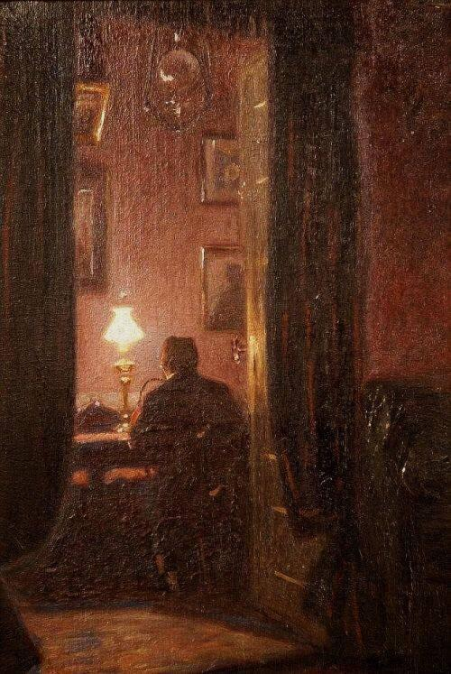

+++
title = "خطاباتٌ تحتضنُ الليل (الخطابُ العاشر)"
description = "يا صديقي، أنا مُصابٌ بي، باستكشافي ومراقبتي، وددتُ لو أغفلُ عن نفسي ربما أستريح."
date = 2021-01-19
+++

 

خطاباتٌ تحتضنُ الليل. v
(الخطابُ العاشر.)  

عزيزي أهلاً،..  
لعلك بخيرٍ ونفسك آمنة في سلام. أتلهفُ لرؤياك، وأشتاقُ كتفك الذي أركنُ إليه.  
 
وددتُ لو أن سمرًا بيننا دائمًا أبدًا،..  
وأنك هُنا رفيقي ومؤنسي.  
 
في تلك المرة لم أكن أعلمُ من أين أبدأ، نفسي قلقةٌ، أُفكرُّ في الغيب كثيرًا، ولو كنتُ أعلمُ الغيب لاستكثرتُ من الخير. أتخيلُ الحياة لحنًا لا أُجيد الرقص عليه، أشردُ كثيرًا فأضيعُ والإيقاع، ليست للحياةِ إعادة، ولا نملكُ اختيار الدور. الأمر المشترك الوحيد أن جميعنا يُمثل ببراعة، لا أُحب التفرّدَ والبطولة ولكن -حقيقةً- لم أكن أُمثل مثلهم، كان الجميعُ يصفقُ دهشةً، ولكنني كنتُ أبكي بحق، وأحبُ بصدق، كنتُ أسمع نفسي دائمًا، تلك القلِقةُ كانت تُتيهني؛ ولهذا ربما لم أملك الإيقاع.  
يا صديقي، أنا مُصابٌ بي، باستكشافي ومراقبتي، وددتُ لو أغفلُ عن نفسي ربما أستريح. أبحثُ عنها وأعلمُ أن الموت يسبقني إليها. بقدرِ ما أعلمهُ عنها أراني جاهلاً، كلما امتلأتُ أشعرُ أني خاوٍ، أشبهُ النار فأقولُ هل من مَزيد؟، أنا نفسُ موسى التي لم تكفُّ عن السؤال. النفسُ أمارةٌ بالسوء وأطمعُ في رحمة الله، ليت النفوسَ رئيفةٌ بأصحابها، فتكونُ عونًا لهم لا عليهم. وليت الأيام تهبنا سكون.  
 
عزيزي،  
وددتك هنا؛ فنتبعثر سويًا ونُلملم بقايانا سويًا،  
وددتُ لو أن سمرًا بيننا دائمًا أبدًا،  
 
كن بخيرٍ وفي سلام،  
واكتب لي.  
١٩ يناير ٢٠٢١م  

