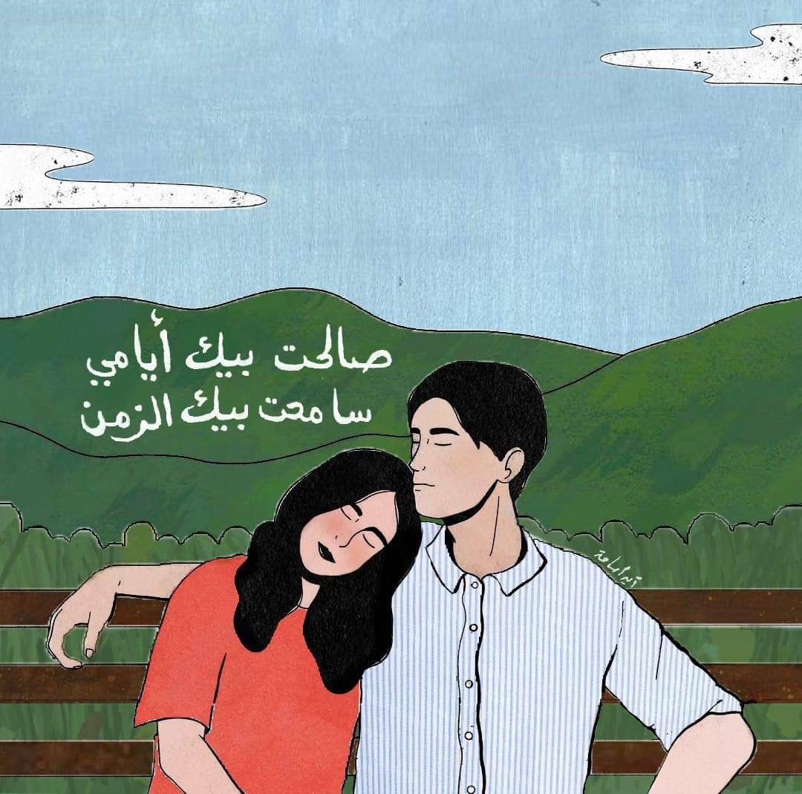

+++
title =  "خطابات تحتضن الليل"
description = "تخيل يا عزيزي أن يهب الحبيبُ المغفرةَ لحبيبهِ، تلك المغفرة التي ودَّ أن ينعم بها يومًا، أن يكون بوّابة السماحِ التي ينسى بها ما قاساهُ من الأيام والأعوام."
date = 2022-10-10
+++

عزيزي أهلاً، 
لعلك آمِنا ويزهر فؤادك بالسلام، وأن فكرك هانئٌ يزدانُ بي. 
أشتاقك فأكتب إليك، وأكتب إليك فأشتاقك أكثر. ويأخذني الحنينُ إليك دائمًا، وما حيلتي سوى أن أحب ما يأخذني إليك. 
عزيزي، 
وددتُ لو أنَّ سمرًا بيننا دائمًا أبدًا، 
وأنك هنا،.. رفيقي ومؤنسي. 

أوشك يومي على الانتهاء، كان هادئًا تمامًا، رتيبًا، وكسولاً مثلي، لا أحب الكسل وليس سجيتي لكنه صديقي هذه الأيام. أحاول جاهدةً فعل أشيائي التي أحب والتي لا أحب أيضًا. 

الجو جميلٌ هذه الأيام، خريفيٌّ ومناسبٌ تمامًا لرفقة سيرٍ طويلةٍ معك، تتساقط فيها أوراق الأشجارِ حولنا استعدادًا لحُلّةٍ جديدة، كما تساقط الحبُّ في قلبينا مُعلنًا ميلادًا جديدًا. السماءُ ليست برائقة -مثلي أيضًا- وكأنها تستدعي ذكريات الأيام الماضية تنثرُ حكاياتها سحبًا في كل مكان، أراها تشاطرني حالي وتتبسَّمُ لي. 

استوقفتني منذ قليلٍ رسمة حانية، تميلُ فيها رأسٌ على كَتِف، أو قل يغفو فيها قلبٌ على قلب، مكتوبٌ عليها قول الست: "صالحت بيك أيامي، 
سامحت بيك الزمن" 
تأملتها وتأملتُ قول الست، وشرعتُ كعادتي أستبصرُ الجمال الذي يؤنس وحشة أيامي، ولأن الحنين دائمًا يأخذني إليك؛ تذكرتك والآن أشاركها معك. 

تخيل يا عزيزي أن يهب الحبيبُ المغفرةَ لحبيبهِ، تلك المغفرة التي ودَّ أن ينعم بها يومًا، أن يكون بوّابة السماحِ التي ينسى بها ما قاساهُ من الأيام والأعوام، الرضا الذي حلَّ بعد سخطٍ، والسلامُ الذي أنار الظلام.  
تلك المغفرةُ يا عزيزي بمفهومها الرحب النقيّ. تذكرني بالله؛ 
فأعلم أن الله غفورٌ يغفر لعباده، وأنه وهّابٌ أيضًا؛ وهب المُحبوب مغفرةً بمجيء حبيبه إليه، من بين قلوب الدنيا ومن كافة أرجاء الأرض.  
تلك التي لأجلها قالت أم كلثوم "صالحت بيك أيامي، سامحت بيك الزمن" 
والتي لأجلها كتب تميم "لعينيك سامحتُ هذا الزمان، وكنت عليه طويل العتب." 
والتي لأجلها أشتاقك فأكتب إليك. 

عزيزي، 
وددتُ لو أن سمرًا بيننا دائمًا أبدًا، 
وأنك هنا، رفيقي ومؤنسي. 

كن سماح الزمن وغفران الأيام 
واحمل الحب في قلبك دائمًا، 
كن بخيرٍ، واكتب لي. 
١٠ أكتوبر ٢٠٢٢م 

