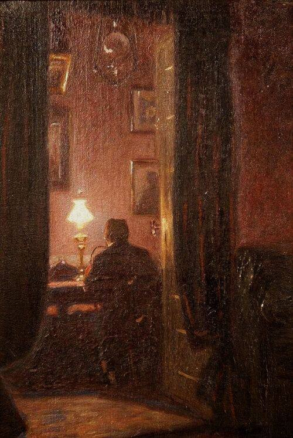

+++
title = "خطاباتٌ تحتضن الليل (الخطاب العشرون)"
description = " الأماني قاسية يا عزيزي نعم، حادّةٌ كالبلور ولامعة، حينما لا نمسسها ترمقنا بنظرةٍ جارحةٍ ربما لا نلتئم بعدها أبدًا. هلّا أخبرتني يا عزيزي كيف ننسى أحلامنا لنشفى؟"
date = 2023-02-10
+++

عزيزي أهلاً، 
آملُ أنك بخير، آمنٌ من كل خيبات الأمل؛ خير الجمال هو الجمال المحتمل.. 

وددتُ لو أن سمرًا بيننا دائمًا أبدًا، 
وأنك هنا،.. رفيقي ومؤنسي. 

 
أحاول منذ وقت لا طويل ولا قصير لكنّي أحاول، ألمس قبسًا من نورٍ وأسير وراءه علَّه يضيئني، أريد أن يمسسني أملٌ يحي نبتة اليقين الساكنة بقلبي. وقلبي أرضٌ خصبةٌ تنتظر راويها، أشعر أني زهرة وضعها العالم في أرضٍ بورٍ ثم قال لها أريني كيف تنبتين. 
ولا أحب الحديث عن العالم بشكلٍ صريح؛ صراحة العالم تكسوه قبحًا لا يُحتمل، لذا كان ملائمًا تمامًا أن يخلق الله الخيال والبديع، أن نقتبس من الجمال نورًا ينير ظلمة الواقع بقدرٍ يمَكِننا أن نحكي عنه. 

 
أتأملُ عزم موسى عليه السلام حينما قال "لا أبرح حتى أبلغ" وأتمنى، أتأمل حاجته الإنسانية سائلاً "ربِّ أرني أنظر إليك" وهو كليم الله؛ قلبي يرقُّ وتحنو عليّ الأمانيّ بعد قسوةٍ. الأماني قاسية يا عزيزي نعم، حادّةٌ كالبلور ولامعة، حينما لا نمسسها ترمقنا بنظرةٍ جارحةٍ ربما لا نلتئم بعدها أبدًا. هلّا أخبرتني يا عزيزي كيف ننسى أحلامنا لنشفى؟ 

 
يحنو الجمال حينما يجد مَن يُربّت عليه ويرعاه، يرق، وتطمئن القلوب، حينما ننساه يقسو ويأكل قلب صاحبه.  
تعلم يا عزيزي، لا أخاف القبح، لماذا أخافه بينما هو واضحٌ فأتجنبه بخفِّة وأمضي؟ لكن يخيفني القبح الكامن بالأشياء الجميلة، ذلك الجمال الذي عرفته، سار إليك فسرت إليه، بسط لك أمواجه فأبحرت فيه، وتركت مجدافك لأن قلبك المطمئن أخذ يسير بك.  
حينما نسيرُ بينما تتوقفُ خُطًا تقابلنا، ماذا نفعل؟ 
وحينما لا نُبصر لؤلؤًا بالقاع كيف ننجو؟ 
ربما ننجو إذا حالفنا القدر والتفت إلينا أحد، لكن جسد يبرأ وروح لا تبرأ لا تسمى نجاه، وقلبٌ صارت تخيفه خطاه، وعينٌ باتت تخشى الجمال. 

 
إني أحاول يا عزيزي، أترفَّعُ عن خَطايا كي لا تتعثر خُطايا، 
لكنني أخاف.. 
 عزيزي، 
أزفُّ بحب وشجاعةٍ خوفي إليك، 
وقلبي يحنو عليك، فابسط يديك 

 
وددتُ لو أن سمرًا بيننا دائمًا أبدًا، 
سمرًا يُذهب وحشتي، 
وأمانًا يطرد خوفتي، 
وجمالًا يؤنس نفسي وحاجتي.. 
وأنك هنا، رفيقي ومؤنسي. 
كن بخيرٍ دائمًا، واكتب لي. 

 
الجمعة/ 
١٠ فبراير ٢٠٢٣م 

