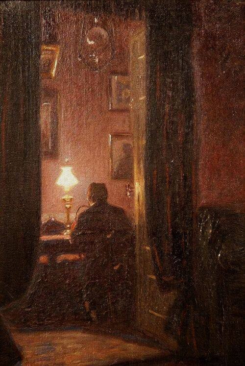

+++
title = "خطاباتٌ تحتضن الليل. (الخطاب الواحد والعشرون)"
description = "الأيام المُحزنة تمضي وتزول، ربما تعود مجددًا، لكن سِربًا من السعادة يأوب بعد الغياب، يعود إلى موطنه الذي هو قلبي."
date = 2023-07-08
+++

عزيزي أهلاً،.. 
أشتاقك فأكتب إليك، وأكتب إليك فأشتاقك أكثر. 
كيفك حالك يا عزيزي؟ لعلك آمنًا وفي سلام، الحبُّ يُزهر فؤادك والسكينة فراشةٌ تطوف ببستان قلبك الجميل. وقلبك كبيرٌ كما عهدته دائما؛ يغفرُ غيابي الطويل ويمدُّ ذراعه فيضمّني والحكايا. 

عزيزي، 
وددتُ لو أنَّ سمرًا بيننا دائمًا أبدًا، 
وأنك هنا، رفيقي ومؤنسي. 

أنا بخيرٍ يا عزيزي، بخيرٍ أكثر من أي وقتٍ مضى، الأيام المُحزنة تمضي وتزول، ربما تعود مجددًا، لكن سِربًا من السعادة يأوب بعد الغياب، يعود إلى موطنه الذي هو قلبي. الخُطى التي تتعثرُ بنا وكأننا لا نعرف السير، تركض يومًا وكأنها تحفظ الطريق عن ظهر قلب. الركض مُتعبٌ والتعثرُ مؤلمٌ ولكنها الحياة.  

وأنا أحب الله يا عزيزي، محبةً تفيض على قلبي فتبعثني لأكتب إليك؛ كان الله بجواري دائمًا، حينما أظلم الطريق، وتفرقت الخطى، وجاورني الحزن وتاهت شرفتي التي أنظر بها إلى العالم. 
حينما لم أعرف موقعي من الحياة والناس ونفسي، حينما لم أجدني وجدت الله؛ فأوجدني.. 
كان الليل طويلاً ومُعتمًا، ولم أدري متى يحلّ النهار، فقط كنت على يقينٍ أنه آتٍ لا محالة فبعث الله لي فجرًا أتنفسه وحدي.  

عزيزي، 
وددتُ لو أن سمرًا بيننا دائمًا أبدًا 
سمرًا يُذهب وحشتي، ويزيل وحدتي 
وأخبرك كم أحب الله واليقين وأحبك. 
كن بخيرٍ دائمًا، 
واكتب لي. 

٨ يوليو ٢٠٢٣م 

