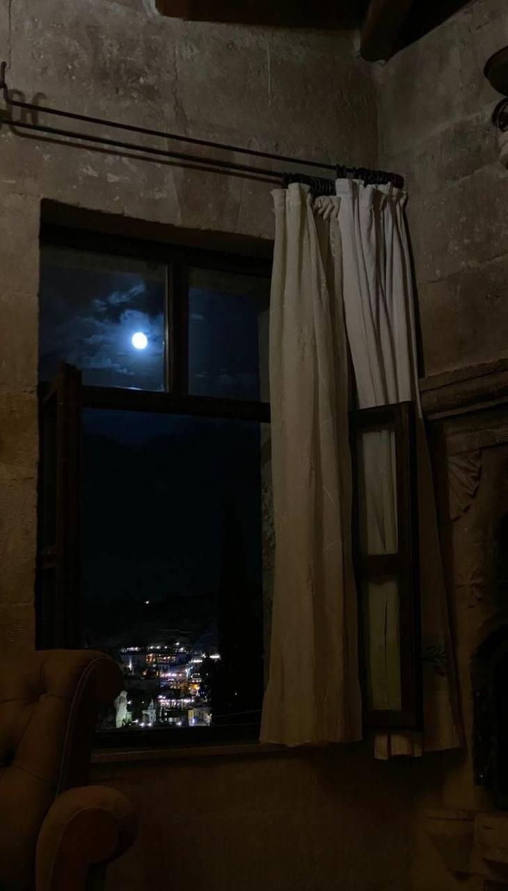

+++
title = "ذات ليلة"
description = "في الليلِ لا يمضي الوقتُ بالساعاتِ والدقائق، لكنّه يمرُّ حاملاً كلَّ الخيباتِ على ظهره، تاليًا كلَّ آياتِ الخوفِ التي سمعها يومًا."
date = 2021-07-12
+++

في الليلِ يجلسُ الحزن جواري بالسرير، أظلُ أتأخرُ في موعدِ النوم كطفلٍ صغيرٍ ينتظرُ أمه، هذه المرةُ لا يريدها أن تقتُلَ العفاريت، بل يريدها لتمسح بيديها الطاهرتين التي ترفعهما للسماءِ على جسدهِ المُنهك. أن تغسلَهُ من الأحزانِ كثوبٍ قديم، أن تسقي قلبه دواء الطمأنينةِ فيخلد إلى النوم. آخر ما فعتله الرقةُّ بقلبه أن ثقبته، وصاحبُ الحزن متخفٍّ كي لا يعلم أحدٌ بأمر قلبه المثقوب. 

في الليلِ لا يمضي الوقتُ بالساعاتِ والدقائق، لكنّه يمرُّ حاملاً كلَّ الخيباتِ على ظهره، تاليًا كلَّ آياتِ الخوفِ التي سمعها يومًا، خانقًا أحلام الطفلِ المنيرة بظلمته، يجرُّ الوحدةَ الأزلية التي باتت عجوزًا باليًا. وربما هذا تفسيرٌ منطقيُّ عن سؤالنا الدائم: لماذا لا يقضي الليل نحبه سريعًا؟

يفترشُ الحزن السرير كملاءةٍ مُزركشةٍ بالفقدِ والبكاء؛ هذه دمعةٌ زرقاء تُشبه فقد الصديق، وهذه دمعةٌ حمراء تُنبيء عن غيابِ المحبوبة. هذه بسمةٌ باهتةٌ، ينظُر إليها قائلاً: أعدُكِ يا أمي ألا أقصُّكِ أحزاني كلها كي لا تغيب، يكفي أن أُخبركِ بعضها لتخففي حِمل قلبيَّ المثقوب. وهذهِ نقطةٌ بعيدةٌ خضراء فاقعٌ لونها تسرَُ الناظرين، إنه سردابُ الأمل. 

أما أنا فترتديني عباءةُ الوحدة، كتبَ عليها الأحبَّةُ أسماءهم قبل الرحيل، كُتِبت أسماؤهم بماء النور، شفافٌ له أثر، كأثرِ الفراشةِ لا يزول. يتماهى الماءُ مع دموع عيني حين ذكرهم، فيضيء حنانًا وشوقًا. ما زلتُ أتساءَل عن السرعةِ التي كتبوا بها أسماءهم ولم ألحظها، ترى هل سرعةُ البرق؟ أو أنها سُرعة الفراقِ وخِفةُ المُفارق.. 
عباءةُ الوحدةِ خفيفةٌ في ليلٍ ثقيلٍ يجلبُ بحملته الصقيع، وأنا واهنٌ يرجو الدفء. أنتظرُ أُمي كي تُمسد جسدي بعطفها، وفي داخلي رجاءٌ ألا تأتي أيضًا كي لا أُذِهب ما بقي من بسمتِها، يحالفني الرجاءُ هذه المرة ولا تأتي. ألتحفُ ملاءة الحُزنِ وأغطُّ في نومٍ سحيق.

